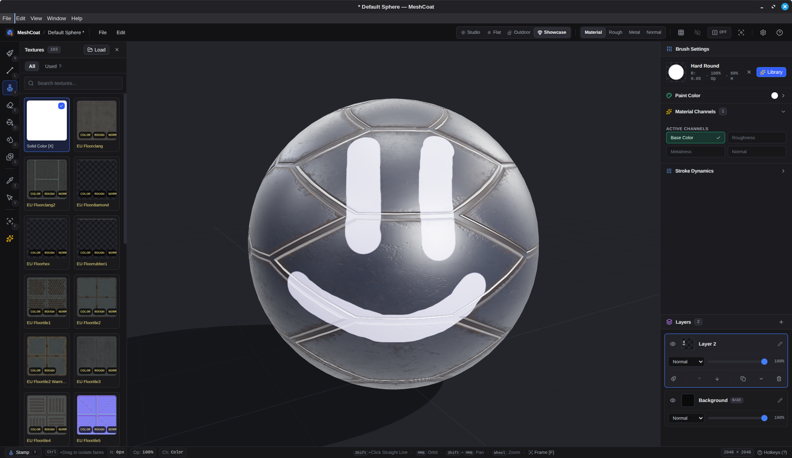
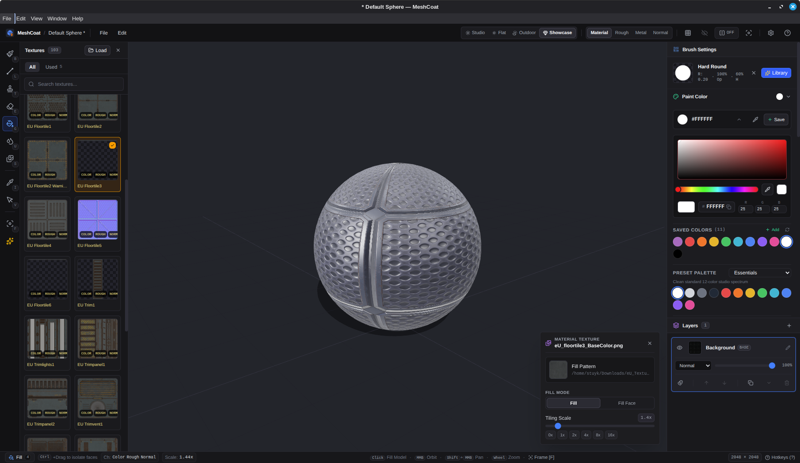
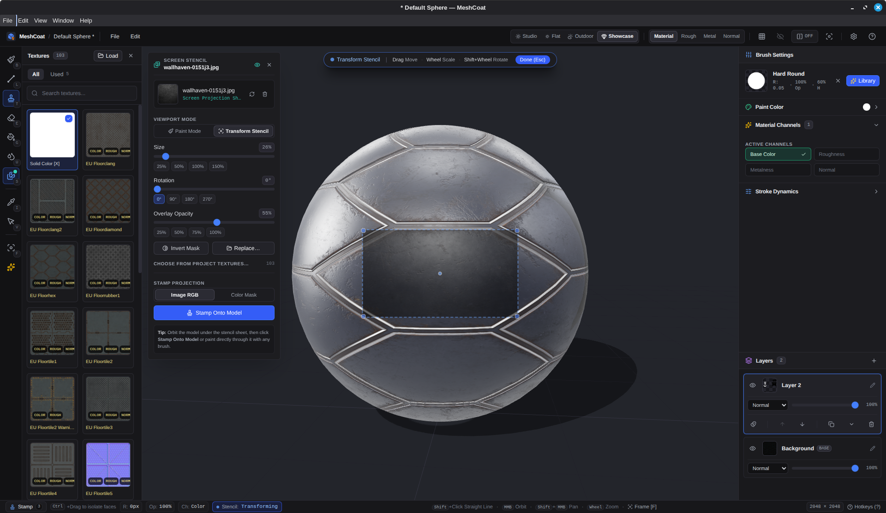
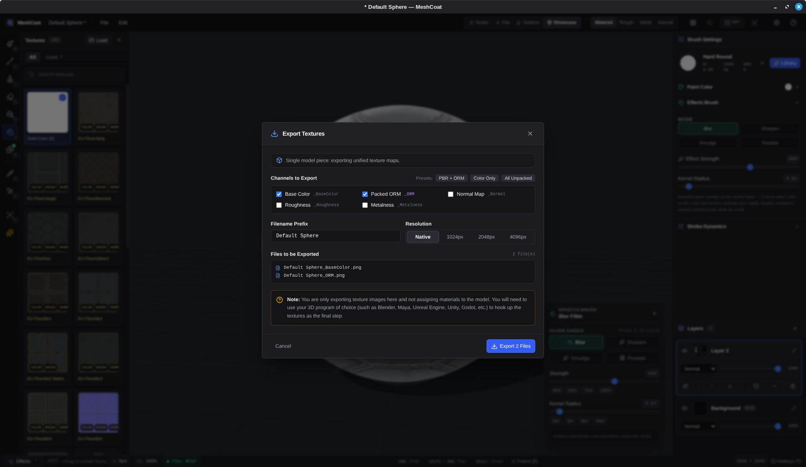
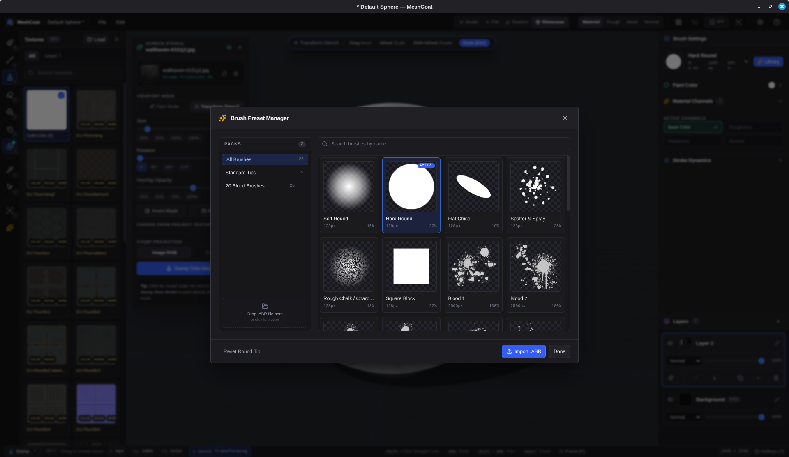

<p align="center">
  
</p>

<h1 align="center">MeshCoat</h1>

<p align="center">
  <strong>Fast, focused 3D model texture painter for game developers and 3D artists.</strong>
</p>

Most 3D texturing suites are bloated, slow to boot, or locked behind subscription paywalls just to paint a texture on a low-poly mesh.

MeshCoat is fast, local, and free. Load your model, pick your canvas resolution, and paint in seconds. No accounts. No subscriptions. No bloat. Just models and textures, yours to keep.

<p align="center">
  <a href="https://github.com/stuyk/meshcoat/releases">
    
  </a>
</p>

<p align="center">
  
  
</p>
<p align="center">
  
  
</p>
<p align="center">
  
</p>

## Core Philosophy

Texture painting should be immediate, tactile, and yours alone. No AI assists, no accounts, no telemetry, no subscriptions. Just a brush, a canvas, and your creativity.

MeshCoat maps brush strokes directly from 3D camera space into UV coordinates in real time using custom hardware-accelerated shaders. Every layer is non-destructive. Composite results update at 60 FPS. You control every pixel. Textures load from any folder on disk, not from a locked proprietary database. When done, export a PNG ready for any game engine or renderer.

## Performance

- **Fast launch:** Lightweight Electron, SolidJS, and Three.js.
- **Hardware-accelerated UV projection:** Offscreen WebGL render targets handle strokes and decals without CPU overhead.
- **Real-time 60 FPS viewport:** Smooth orbit, pan, zoom, and wireframe even during heavy paint.
- **Multi-resolution:** Paint from 512x512 retro up to 8192x8192 high-detail.
- **100% offline and private:** Zero telemetry, no tracking, no network calls. Runs on your machine only.

## What It Does

### Painting

- **Direct 3D Surface Painting:** Paint directly onto 3D geometry with strokes and texture patterns automatically projected onto the model's UV layout. The brush is a 3D projector, not a sphere, so it never bleeds through thin walls or paints hidden faces.
- **PBR Material Painting:** The brush is a *material* brush. One stroke writes **Base Color, Roughness, Metalness and a tangent-space Normal map** at once and in perfect register — gold is a single brush (yellow + 0.1 rough + 1.0 metal), not three passes to line up by hand. Each channel toggles independently, eight material presets ship with it (Polished Gold, Brushed Steel, Rusted Iron, Copper, Glossy Plastic, Matte Rubber, Rough Wood, Wet Clay), and a layer only allocates a channel once a stroke actually writes to it — a flat-color project costs exactly what it always did.
- **Normal relief from the dab itself:** The normal channel takes its slope from whatever shapes the stroke — a custom tip's alpha, a stamped image's alpha, or the round falloff when neither is set — re-expressed in the mesh's UV tangent frame. Negative strength engraves instead of embossing.
- **Painting with PBR texture sets:** A folder of loose files (`rock_BaseColor.png`, `rock_Roughness.png`, `rock_Normal.png`) is grouped back into the material it came from and shows in the shelf as one card. Pick it and paint — every channel the set ships lands in one stroke. Suffix conventions from Substance, Quixel, Poliigon, ambientCG and Blender are recognised.
- **Non-Destructive Layer Stack:** Create, hide, reorder, adjust opacity, duplicate, and merge multiple paint layers with live composite blending.
- **Layer Masks:** Toggle any layer between paint and mask mode. Masks multiply the layers below them, but only when explicitly stacked. No automatic masking.
- **Symmetry Mirror Painting:** Mirror strokes, stamps, and fills across the model's X, Y, or Z axis in real time.
- **Undo/Redo:** Full 100-step history per piece for every stroke, fill, effect, layer op, and generator run via Ctrl+Z/Ctrl+Y or the Edit menu.

### Tools

- **Brush (`B`):** Freehand painting with radius, hardness, opacity, spacing, and texture projection (surface UV, triplanar, or brush-tip decal). Pen pressure controls size and opacity independently. Shift+click draws straight lines following the surface.
- **Line (`L`):** Click-drag a straight interpolated stroke between two surface points.
- **Stamp (`T`):** Place texture decals at cursor points, with full pen pressure support.
- **Eraser (`E`):** Erase with independent opacity and hardness control. Takes coverage back out of the PBR channels rather than stamping zeros over them.
- **Fill Bucket (`G`):** Flood fill colors, textures or whole material sets across the model, the active face selection, or a single clicked face.
- **Effects Brush (`U`):** Rework existing paint instead of adding color. Four modes: Blur, Sharpen, Smudge (follows your stroke), Pixelate. Filters every channel a layer carries, so a blurred stroke doesn't leave razor-sharp roughness underneath it.
- **Eyedropper (`I`):** Sample colors directly from the 3D model — including from a piece that isn't the active one.
- **Face Selection (`V`):** Highlight faces to restrict all other tools to those surfaces. Hold Ctrl on any tool to select faces without switching modes; Alt+click selects a whole connected UV island.
- **Edge Wear & Crevice Dirt Wizard:** Two generators for procedural wear, both with live 3D preview and color presets. "Edge Wear" highlights ridges and edges; "Crevice Dirt" fills interior folds and corners. A Smoothness slider trades noise for a clean ambient-occlusion look. Preview in new or existing layers, then commit in one click.
- **Screen-Space Stencil (`S`):** Load a PNG that floats on the viewport instead of the model (the Mari/Mudbox workflow). Paint through it with any brush, or "Stamp Onto Model" to project the whole image as a decal in one pass. Stamp can use the image's own colors, or read its brightness to mask with your current paint color.

### Multi-Piece Models

- **One piece = one texture set.** Every separate object in the file gets its own layer stack, resolution, undo history, maps and exported PNGs — the way Substance treats texture sets — because separate parts usually reuse the same 0–1 UV square.
- **Explicit selection.** Switch with `Tab` / `Shift+Tab`, the dropdown above the Layers list, or a double-click on the piece in the viewport. Selection is never automatic, so painting near an overlapping part can't jump to that part mid-stroke. An amber box and a viewport badge always say which piece is live.
- **Painting stays on the selected piece** even where a neighbouring part sits in front of it; the parts genuinely hidden behind that neighbour are rejected by the occlusion test.
- **Isolate Active Piece:** hide every other piece with one button to reach inside tight crevices or interior geometry. Switching pieces re-isolates the new selection.

### Import & Export

- **Import Wizard (`Ctrl+N`):** Three tabs — Import 3D Model & PBR, Quick Start Primitives, and Recent Projects.
  - Inspects the model on pick and detects single vs. multi-piece.
  - **Shared Texture Map** across all pieces, or **Per-Component Maps** with dedicated channel slots per piece and a "copy to all components" action.
  - Dedicated slots for Base Color, Roughness, Metalness, Normal and packed **ORM**, with automatic sibling-map detection from standard filename conventions and automatic ORM unpacking on load.
  - Quick Start primitives: UV Sphere and a UV-unwrapped cube with a real non-overlapping 3×2 island layout.
  - Optional texture-library folder to preload the shelf, plus auto-recovery of an unsaved session.
- **Export Wizard (`Ctrl+E`):** One modal for every map.
  - **Individual Pieces** (`Model_Piece_Channel.png`) or **Single Image (Shared UV / Atlas)** (`Model_Channel.png`), where each piece is clipped to its own UV coverage before compositing.
  - Channel toggles for Base Color, packed ORM, Roughness, Metalness and Normal, with one-click presets: *PBR + ORM*, *Color Only*, *All Unpacked*.
  - Native resolution or a 1024 / 2048 / 4096 override, plus a live list of the exact files to be written.
- **Direct model open (`Ctrl+O`)** for `.glb`, `.gltf` and `.obj`, bypassing the wizard.
- **Project files (`.meshcoat`):** Full multi-piece, multi-layer projects with per-layer PBR channels, plus autosave every 60 seconds and rolling backups.

### Viewport

- **Lighting presets:** Studio (balanced three-point), Flat (near-shadowless, for judging raw texture color), Outdoor (warm sun, cool sky), and **Showcase** — environment-dominant with a raking key and real cast shadows on a ground catcher, for judging material response rather than form. A prefiltered `RoomEnvironment` provides image-based lighting, without which a painted metalness map would read as flat grey paint.
- **Channel view modes:** the full shaded material (base color included), or one isolated map — Rough / Metal / Normal — shown unlit so values can be read straight off the surface.
- **Wireframe Overlay (`W`):** Inspect topology and UV seams while painting.
- **Integrated Texture Shelf:** Browse textures from any folder on disk with search, material-set grouping, and a "Used" tab of recent picks. `.tga` albedos load through three's `TGALoader` rather than being silently dropped.
- **Interactive Brush Gestures:** Adjust radius with <kbd>[</kbd> and <kbd>]</kbd> or right-drag. Shift+right-drag adjusts opacity and hardness. Hold <kbd>Space</kbd> for the radial tool wheel.
- **Smooth 3D Navigation:** Alt+left-click to orbit, Alt+middle-click to pan, Alt+right-click or wheel to zoom. Press <kbd>F</kbd> to frame the model.
- **Help & Documentation (`?`):** Searchable keyboard-shortcut tables plus workflow guides for PBR painting, multi-piece meshes, the wear generators, stencils, effects and exporting.

## Quick Start

Requires [Bun](https://bun.sh).

```bash
bun install
bun run dev
```

The Welcome wizard opens on launch (`Ctrl+N` to reopen). Pick a 3D model (`.obj`, `.glb`, or `.gltf`) and a starting resolution (512 to 8192) — bring its existing Base Color / Roughness / Metalness / Normal / ORM maps along if it has them, and they load straight onto the layer stack — or start from a UV sphere or an unwrapped cube. When you're done, `Ctrl+E` opens the export wizard.

## Keybindings

| Key | Action |
| --- | --- |
| `1` / `B` | Brush tool |
| `L` | Line tool |
| `2` / `E` | Eraser tool |
| `3` / `T` | Stamp tool |
| `4` / `G` | Fill bucket |
| `5` / `I` | Eyedropper |
| `6` / `V` | Face selection tool |
| `7` / `U` | Effects brush (blur, sharpen, smudge, pixelate) |
| `Shift` + Click | Draw straight line from last dab (brush, stamp, eraser only) |
| `S` | Toggle screen stencil panel |
| `R` / `Shift` + `R` | Rotate brush tip +/- 15° |
| `X` | Toggle solid color / texture (on a mask layer: black ↔ white) |
| `Alt` + `X` | Cycle symmetry axis (off → X → Y → Z) |
| `Ctrl` + Click / Drag | Select faces on any tool |
| `Ctrl` + `Shift` + Drag | Deselect faces |
| `Alt` + Click / Double-click | Select connected UV island (face select or Ctrl) |
| `Ctrl` + `A` / `Ctrl` + `I` / `Ctrl` + `D` | Select all / invert / clear face selection |
| `Esc` | Clear face selection |
| `[` / `]` | Decrease / increase brush radius (tiling scale with Fill or Shift) |
| `RMB` + Drag X | Interactively resize radius |
| `Shift` + `RMB` + Drag Y | Interactively adjust opacity and hardness |
| `Alt` + `LMB` | Orbit camera |
| `Alt` + `MMB` | Pan camera |
| `Alt` + `RMB` or Wheel | Zoom camera |
| `F` | Frame model in view |
| `W` | Toggle wireframe overlay |
| `Tab` / `Shift` + `Tab` | Next / previous piece (multi-piece models) |
| Double-click | Select the piece under the cursor |
| `Space` (hold) | Radial tool wheel |
| `Ctrl` + `N` | Welcome / import wizard |
| `Ctrl` + `O` | Open a 3D model directly |
| `Ctrl` + `S` / `Ctrl` + `Shift` + `S` | Save project / Save As |
| `Ctrl` + `E` | Export wizard |
| `Ctrl` + `Z` | Undo |
| `Ctrl` + `Y` or `Ctrl` + `Shift` + `Z` | Redo |
| `?` | Help and hotkeys |

## Model Preparation & UVs

MeshCoat paints directly into your model's UV layout:

1. **Multiple Pieces:** Every separate object in the file becomes its own texture set — its own layer stack, undo history, maps and exported PNGs. Pick the piece to paint from the selector above the Layers list, by double-clicking it in the viewport, or with Tab / Shift+Tab. Selection is never automatic and strokes never cross onto another piece: painting always targets the selected piece even where a neighbouring part is in front of it, and the parts genuinely hidden behind that neighbour are rejected by the occlusion test. Join parts into one mesh (in Blender: select all parts and press <kbd>Ctrl+J</kbd>) only if you want them to share a single texture.
2. **Weld Seams:** Run *Mesh > Merge > By Distance* in Blender to prevent hairline gaps along seams.
3. **Clean UV Unwrap:** Ensure faces have non-overlapping UV coordinates so brush strokes map cleanly to the intended surfaces without texture mirroring or bleeding.
4. **Export Formats:** Export as `.obj`, `.glb`, or `.gltf`.

## Releases

Releases are driven by `package.json`'s `version` field. GitHub Actions automatically builds and publishes release binaries for Linux, Windows, and macOS.

## Building

```bash
bun run build:linux  # AppImage, deb, tar.gz
bun run build:win    # NSIS installer, portable exe
bun run build:mac    # DMG, zip
bun run build:all    # All targets
```

## Stack

- **Runtime & Desktop Shell:** Electron 39, Node 22, Bun
- **Frontend & State:** SolidJS, Tailwind CSS v4, Lucide Icons (`lucide-solid`)
- **3D Graphics & Viewport:** Three.js, WebGL, custom GLSL projection shaders
- **Build System:** electron-vite, Vite, TypeScript

## License

GPL-3.0-or-later. See [LICENSE](LICENSE).