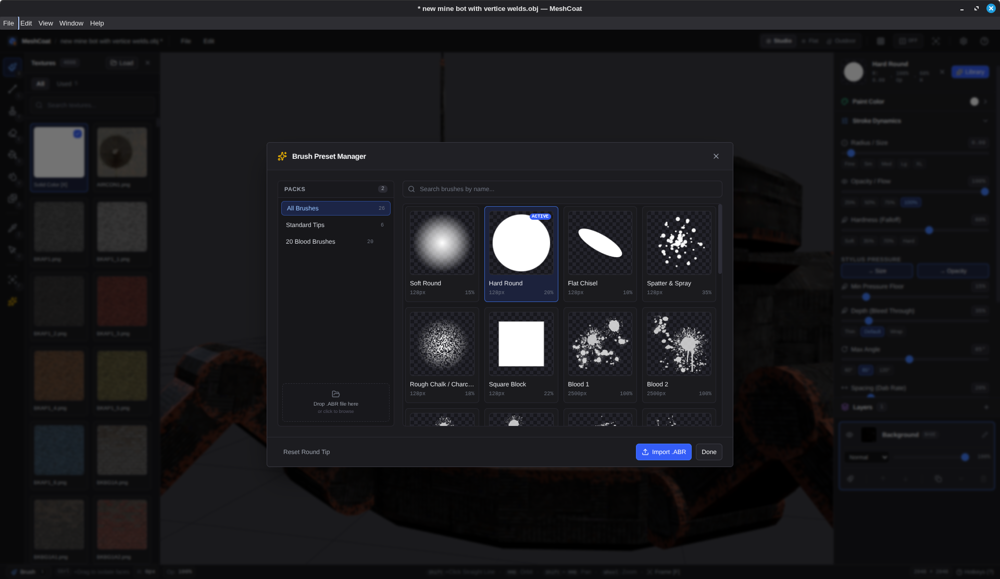
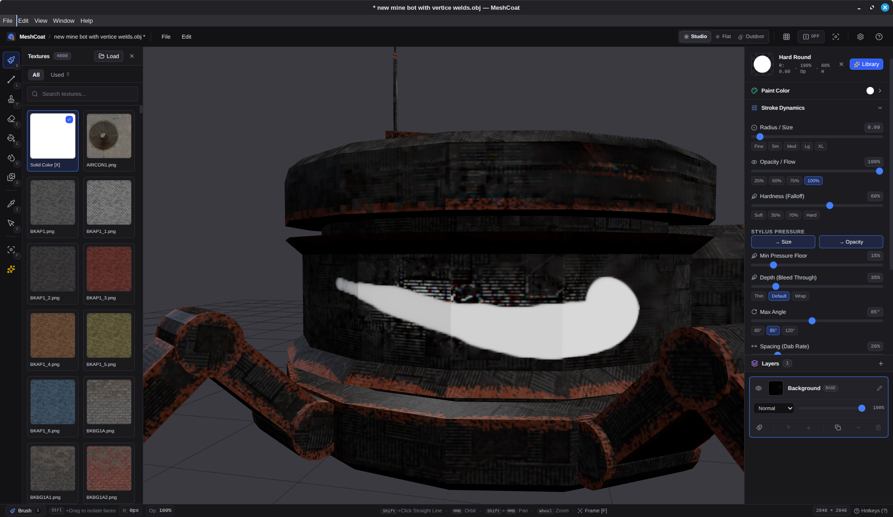
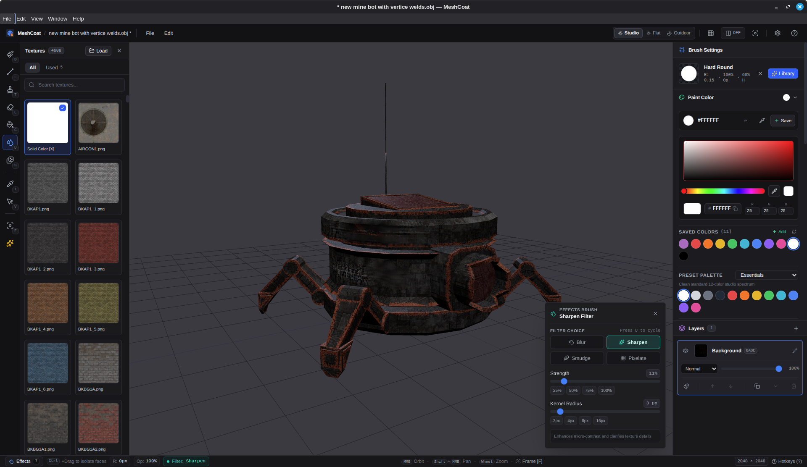
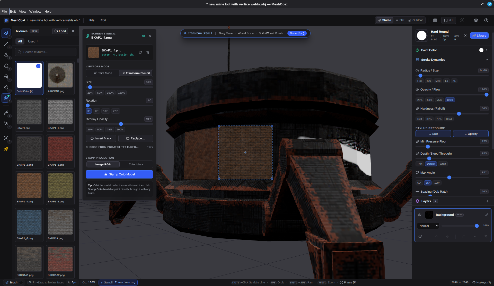

<p align="center">
  
</p>

<h1 align="center">MeshCoat</h1>

<p align="center">
  <strong>Fast, focused 3D model texture painter for game developers and 3D artists.</strong>
</p>

Most 3D texturing suites are bloated, slow to boot, or locked behind subscription paywalls just to paint a texture on a low-poly mesh.

MeshCoat is fast, local, and free. Load your model, pick your canvas resolution, and paint in seconds. No accounts. No subscriptions. No bloat. Just models and textures, yours to keep.

<p align="center">
  <a href="https://github.com/stuyk/meshcoat/releases">
    
  </a>
</p>

<p align="center">
  
  
</p>
<p align="center">
  
  
</p>

## Core Philosophy

Texture painting should be immediate, tactile, and yours alone. No AI assists, no accounts, no telemetry, no subscriptions. Just a brush, a canvas, and your creativity.

MeshCoat maps brush strokes directly from 3D camera space into UV coordinates in real time using custom hardware-accelerated shaders. Every layer is non-destructive. Composite results update at 60 FPS. You control every pixel. Textures load from any folder on disk, not from a locked proprietary database. When done, export a PNG ready for any game engine or renderer.

## Performance

- **Fast launch:** Lightweight Electron, SolidJS, and Three.js.
- **Hardware-accelerated UV projection:** Offscreen WebGL render targets handle strokes and decals without CPU overhead.
- **Real-time 60 FPS viewport:** Smooth orbit, pan, zoom, and wireframe even during heavy paint.
- **Multi-resolution:** Paint from 512x512 retro up to 8192x8192 high-detail.
- **100% offline and private:** Zero telemetry, no tracking, no network calls. Runs on your machine only.

## What It Does

- **Direct 3D Surface Painting:** Paint directly onto 3D geometry with strokes and texture patterns automatically projected onto the model's UV layout. The brush is a 3D projector, not a sphere, so it never bleeds through thin walls or paints hidden faces.
- **Non-Destructive Layer Stack:** Create, hide, reorder, adjust opacity, duplicate, and merge multiple paint layers with live composite blending.
- **Versatile Tool Suite:**
  - **Brush (`B`):** Freehand painting with radius, hardness, opacity, spacing, and texture projection. Pen pressure controls size and opacity independently. Shift+click draws straight lines following the surface.
  - **Stamp (`T`):** Place texture decals at cursor points, with full pen pressure support.
  - **Eraser (`E`):** Erase with independent opacity and hardness control.
  - **Fill Bucket (`G`):** Flood fill colors or textures across whole model or selected faces only.
  - **Effects Brush (`U`):** Rework existing paint instead of adding color. Four modes: Blur, Sharpen, Smudge (follows your stroke), Pixelate. Each has independent radius and strength controls.
  - **Eyedropper (`I`):** Sample RGB colors directly from the 3D model.
  - **Face Selection (`V`):** Highlight faces to restrict all other tools (brush, eraser, fill, effects) to those surfaces. Hold Ctrl on any tool to select faces without switching modes.
- **Layer Masks:** Toggle any layer between paint and mask mode. Masks multiply the layers below them, but only when explicitly stacked. No automatic masking.
- **Symmetry Mirror Painting:** Mirror strokes, stamps, and fills across the model's X, Y, or Z axis in real time.
- **Edge Wear & Crevice Dirt Wizard:** Two generators for procedural wear, both with live 3D preview and color presets. "Edge Wear" highlights ridges and edges; "Crevice Dirt" fills interior folds and corners. A Smoothness slider trades noise for clean ambient-occlusion look. Preview in new or existing layers, then commit in one click.
- **Screen-Space Stencil:** Load a PNG that floats on the viewport instead of the model (the Mari/Mudbox workflow). Paint through it with any brush, or click "Stamp Onto Model" to project the entire image as a decal in one pass. Stamp can use the image's colors, or read brightness to mask with your current paint color. Works with pen pressure and face selection.
- **Integrated Texture Shelf:** Browse PNG/JPG textures from any folder on disk with search and quick-access. "Used" tab shows your 5 most recent picks. Remembers the last folder.
- **Lighting & View Modes:** Lit mode (directional plus ambient for depth) or Flat mode (unlit colors for pure texture work).
- **Wireframe Overlay (`W`):** Toggle wireframe to inspect topology and UV seams while painting.
- **Interactive Brush Gestures:** Adjust radius with <kbd>[</kbd> and <kbd>]</kbd> or right-drag. Shift+right-drag adjusts opacity and hardness.
- **Smooth 3D Navigation:** Alt+left-click to orbit, Alt+middle-click to pan, Alt+right-click or wheel to zoom. Press <kbd>F</kbd> to frame the model.
- **Format Support:** Loads .obj, .glb, and .gltf files. Validates UVs automatically.
- **PNG Export:** Save the composite texture map in one click, ready for any game engine or renderer.
- **Undo/Redo:** Full 100-step history for every stroke, fill, effect, layer op, and generator run via Ctrl+Z/Ctrl+Y or the Edit menu.

## Quick Start

Requires [Bun](https://bun.sh).

```bash
bun install
bun run dev
```

Start a new project (`File` > `New Project`), pick your 3D model (`.obj`, `.glb`, or `.gltf`) and starting resolution (512 to 8192), and begin painting!

## Keybindings

| Key | Action |
| --- | --- |
| `B` | Brush tool |
| `T` | Stamp tool |
| `E` | Eraser tool |
| `G` | Fill bucket |
| `U` | Effects brush (blur, sharpen, smudge, pixelate) |
| `I` | Eyedropper |
| `V` | Face selection tool |
| `Shift` + Click | Draw straight line from last dab (brush, stamp, eraser only) |
| `S` | Toggle screen stencil panel |
| `Ctrl` + Click / Drag | Select faces on any tool |
| `Ctrl` + `Shift` + Drag | Deselect faces |
| `Esc` | Clear face selection |
| `[` / `]` | Decrease / increase brush radius |
| `RMB` + Drag X | Interactively resize radius |
| `Shift` + `RMB` + Drag Y | Interactively adjust opacity and hardness |
| `Alt` + `LMB` | Orbit camera |
| `Alt` + `MMB` | Pan camera |
| `Alt` + `RMB` or Wheel | Zoom camera |
| `F` | Frame model in view |
| `W` | Toggle wireframe overlay |
| `Space` (hold) | Radial tool wheel |
| `Ctrl` + `Z` | Undo |
| `Ctrl` + `Y` or `Ctrl` + `Shift` + `Z` | Redo |
| `?` | Help and hotkeys |

## Model Preparation & UVs

MeshCoat paints directly into your model's UV layout:

1. **Single Mesh:** Ensure your model is joined into a single mesh object before export (in Blender: select all parts and press <kbd>Ctrl+J</kbd>).
2. **Weld Seams:** Run *Mesh > Merge > By Distance* in Blender to prevent hairline gaps along seams.
3. **Clean UV Unwrap:** Ensure faces have non-overlapping UV coordinates so brush strokes map cleanly to the intended surfaces without texture mirroring or bleeding.
4. **Export Formats:** Export as `.obj`, `.glb`, or `.gltf`.

## Releases

Releases are driven by `package.json`'s `version` field. GitHub Actions automatically builds and publishes release binaries for Linux, Windows, and macOS.

## Building

```bash
bun run build:linux  # AppImage, deb, tar.gz
bun run build:win    # NSIS installer, portable exe
bun run build:mac    # DMG, zip
bun run build:all    # All targets
```

## Stack

- **Runtime & Desktop Shell:** Electron 39, Node 22, Bun
- **Frontend & State:** SolidJS, Tailwind CSS v4, Lucide Icons (`lucide-solid`)
- **3D Graphics & Viewport:** Three.js, WebGL, custom GLSL projection shaders
- **Build System:** electron-vite, Vite, TypeScript

## License

GPL-3.0-or-later. See [LICENSE](LICENSE).