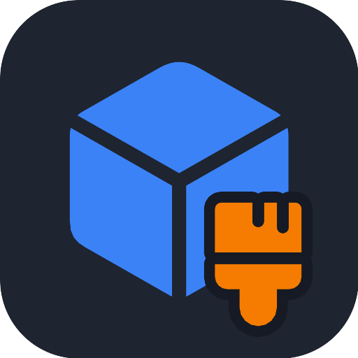
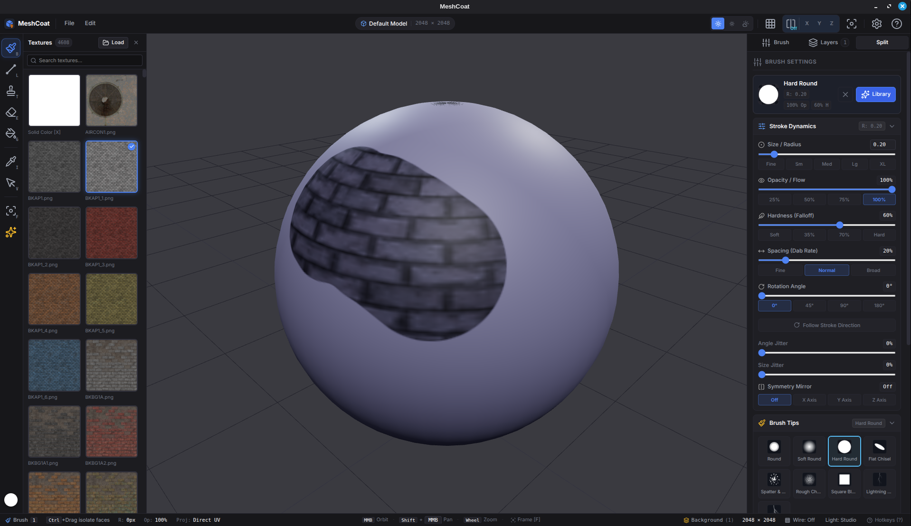
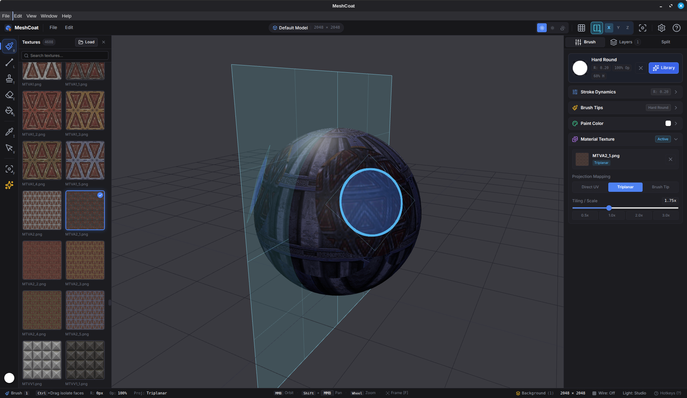
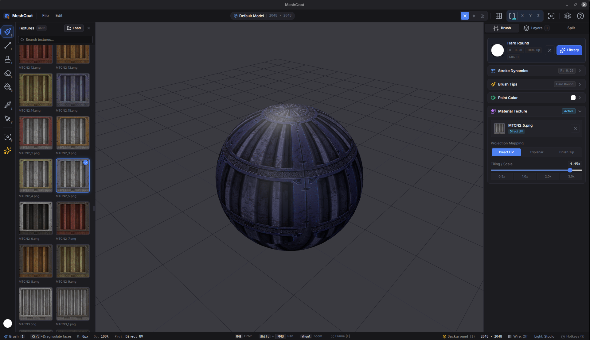
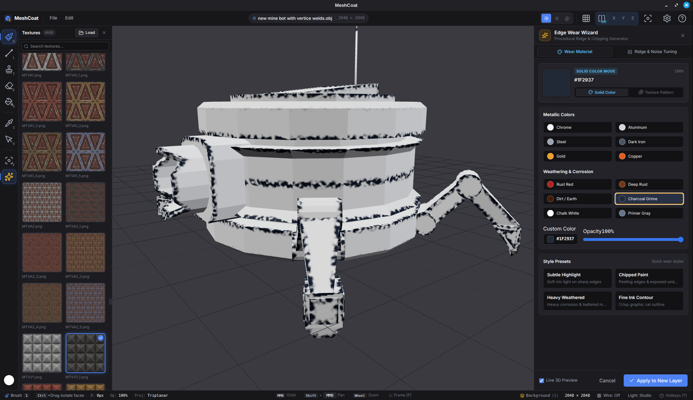

<p align="center">
  
</p>

<h1 align="center">MeshCoat</h1>

<p align="center">
  <strong>Fast, focused 3D model texture painter for game developers and 3D artists.</strong>
</p>

Most 3D texturing suites are bloated giants with multi-gigabyte installations, slow boot times, or steep subscription paywalls just to paint a texture on a low-poly mesh.

MeshCoat is fast, local, and free. Load your 3D model, choose your canvas resolution, and start painting directly on your surfaces in seconds. No cloud accounts, no subscriptions, no bloat. Just your models and your textures.

<p align="center">
  <a href="https://github.com/stuyk/meshcoat/releases">
    
  </a>
</p>

<p align="center">
  
  
</p>
<p align="center">
  
  
</p>

## Core Philosophy

Texture painting should feel immediate, tactile, and frictionless. 

MeshCoat maps your brush strokes directly from 3D camera space into UV coordinates in real time using custom hardware-accelerated shaders. Every layer is non-destructive, composite results update at 60 FPS, and you can pull textures directly from any folder on your drive without importing them into an opaque proprietary asset database. When you're done, export a crisp PNG ready for Godot, Unity, Unreal Engine, or Blender.

## Performance

- **Instant launch:** Boots in under a second with lightweight Electron, SolidJS, and Three.js.
- **Hardware-accelerated UV projection:** Offscreen WebGL render targets project strokes and decals without CPU bottlenecks.
- **Real-time 60 FPS viewport:** Smooth orbit, pan, zoom, and wireframe previews even during heavy paint strokes.
- **Multi-resolution support:** Paint on canvas sizes from retro 512×512 up to high-detail 8192×8192.
- **100% offline & private:** Zero telemetry, no user tracking, no network calls. Runs entirely on your local machine.

## What It Does

- **Direct 3D Surface Painting:** Paint directly onto 3D geometry with strokes and texture patterns automatically projected onto the model's UV layout.
- **Non-Destructive Layer Stack:** Create, hide, reorder, adjust opacity, duplicate, and merge multiple paint layers with live composite blending.
- **Versatile Tool Suite:**
  - **Brush (`B`):** Freehand painting with customizable radius, hardness, opacity, spacing, and texture pattern projection.
  - **Stamp (`T`):** Stamp textures or decals directly onto mesh surfaces at cursor hit points.
  - **Eraser (`E`):** Erase layer contents with full opacity and edge hardness control.
  - **Fill Bucket (`G`):** Flood fill active layers with solid colors, or confine fills strictly to selected faces.
  - **Eyedropper (`I`):** Sample exact RGB colors directly from any point on the textured 3D model.
  - **Face Selection (`V` / `Ctrl`):** Highlight faces with cyan outlines to restrict brush strokes and fills to specific geometry.
- **Quick Face Masking (`Ctrl` + Click / Drag):** Hold <kbd>Ctrl</kbd> on **any tool** to click or sweep-drag across faces. All subsequent brush strokes, stamps, and fills are automatically confined to the highlighted selection. Hold <kbd>Ctrl</kbd>+<kbd>Shift</kbd> to deselect, or press <kbd>Esc</kbd> to clear.
- **Integrated Texture Shelf:** Browse folders of PNG/JPG textures on your drive with a 2-wide shelf, instant search, and one-click decal selection. Remembers your last folder automatically.
- **Lighting & View Modes:** Switch between Lit mode (directional + ambient lighting for depth) and Flat mode (unlit color view for pure texture painting).
- **Wireframe Overlay (`W`):** Toggle wireframe overlay on the fly to inspect topology and UV islands while painting.
- **Interactive Brush Gestures:** Adjust radius dynamically using <kbd>[</kbd> and <kbd>]</kbd> or by dragging <kbd>RMB</kbd>. Adjust hardness and opacity with <kbd>Shift</kbd> + <kbd>RMB</kbd> drag.
- **Smooth 3D Navigation:** Standard DCC camera controls: <kbd>Alt</kbd>+<kbd>LMB</kbd> to orbit, <kbd>Alt</kbd>+<kbd>MMB</kbd> to pan, <kbd>Alt</kbd>+<kbd>RMB</kbd> / wheel to zoom, and <kbd>F</kbd> to frame the model.
- **Format Support:** Loads `.obj`, `.gltf`, and `.glb` files with automatic UV validation.
- **One-Click PNG Export:** Export the composite base color map directly to disk ready for your game engine or render pipeline.
- **Undo / Redo:** Full multi-step history for paint strokes, layer edits, and fills (<kbd>Ctrl+Z</kbd> / <kbd>Ctrl+Y</kbd>).

## Quick Start

Requires [Bun](https://bun.sh).

```bash
bun install
bun run dev
```

Start a new project (`File` > `New Project`), pick your 3D model (`.obj`, `.glb`, or `.gltf`) and starting resolution (512 to 8192), and begin painting!

## Keybindings

| Key | Action |
| --- | --- |
| `B` | Brush tool |
| `T` | Stamp tool (place texture decal) |
| `E` | Eraser tool |
| `G` | Fill bucket (layer or selected faces) |
| `I` | Eyedropper (sample surface color) |
| `V` | Face selection tool |
| `Ctrl` + Click / Drag | Select & highlight faces on any tool |
| `Ctrl` + `Shift` + Drag | Deselect faces |
| `Esc` | Clear face selection |
| `[` / `]` | Decrease / increase brush radius |
| `RMB` + Drag X | Interactively resize brush radius |
| `Shift` + `RMB` + Drag Y | Interactively adjust opacity / hardness |
| `Alt` + `LMB` (or `MMB`) | Orbit camera |
| `Alt` + `MMB` (or `Shift` + `MMB`) | Pan camera |
| `Alt` + `RMB` (or Wheel) | Zoom camera |
| `F` | Focus / frame model in view |
| `W` | Toggle wireframe overlay |
| `Ctrl` + `Z` | Undo last stroke / action |
| `Ctrl` + `Y` | Redo action |
| `?` | Toggle quick guide & hotkeys |

## Model Preparation & UVs

MeshCoat paints directly into your model's UV layout:

1. **Single Mesh:** Ensure your model is joined into a single mesh object before export (in Blender: select all parts and press <kbd>Ctrl+J</kbd>).
2. **Weld Seams:** Run *Mesh > Merge > By Distance* in Blender to prevent hairline gaps along seams.
3. **Clean UV Unwrap:** Ensure faces have non-overlapping UV coordinates so brush strokes map cleanly to the intended surfaces without texture mirroring or bleeding.
4. **Export Formats:** Export as `.obj`, `.glb`, or `.gltf`.

## Releases

Releases are driven by `package.json`'s `version` field. GitHub Actions automatically builds and publishes release binaries for Linux, Windows, and macOS.

## Building

```bash
bun run build:linux  # AppImage, deb, tar.gz
bun run build:win    # NSIS installer, portable exe
bun run build:mac    # DMG, zip
bun run build:all    # All targets
```

## Stack

- **Runtime & Desktop Shell:** Electron 39, Node 22, Bun
- **Frontend & State:** SolidJS, Tailwind CSS v4, Lucide Icons (`lucide-solid`)
- **3D Graphics & Viewport:** Three.js, WebGL, custom GLSL projection shaders
- **Build System:** electron-vite, Vite, TypeScript

## Alternative To

A free, fast, local, and lightweight alternative to Substance 3D Painter, ArmorPaint, Marmoset Toolbag, or Blender's texture painting tab when you want to jump straight into painting textures without setup overhead.

## License

GPL-3.0-or-later. See [LICENSE](LICENSE).